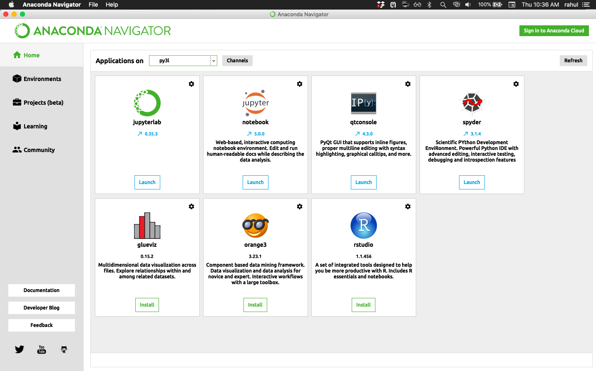
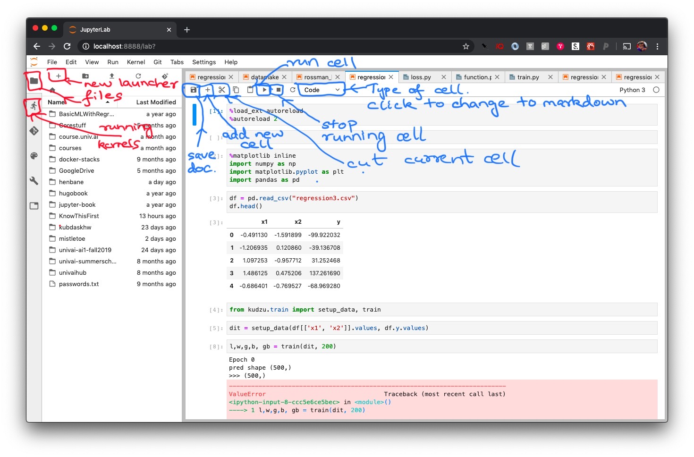

---
layout: page
title: Installing and Using Anaconda Python
math: true
--- 

Please try these things out before you come to the first class!

## First Install Anaconda

You will need to first install Anaconda Python. The packages are [here](https://www.anaconda.com/products/individual#Downloads). You need to install the Python 3.7 version

These short videos from our youtube channel (recorded by Akshaj) walk you through the process of downloading and installing Anaconda.

First download:

<iframe width="916" height="491" src="https://www.youtube.com/embed/oJk4wbWCBIw" frameborder="0" allow="accelerometer; autoplay; encrypted-media; gyroscope; picture-in-picture" allowfullscreen></iframe>

Then install:

<iframe width="887" height="499" src="https://www.youtube.com/embed/HHnoXU-BcPE" frameborder="0" allow="accelerometer; autoplay; encrypted-media; gyroscope; picture-in-picture" allowfullscreen></iframe>

## Starting Anaconda



(1) Bring up the "Anaconda Navigator" from your Start Menu, Panel or text-entry point.

(2) Then click on "Jupyterlab". This will open up a web browser for you with a screen that looks like the next picture.


This screen is called the **Launcher**. Click on "Python 3". This launches a "kernel" or python process, and connects a new document window, called a **Jupyter Notebook** to this process. 

## The Jupyter Notebook


You can now type in text boxes in the Jupyter Notebook, called **cells** in this new window. The left side is a file manager and is likely showing your home folder. This notebook is called `Untitled.ipynb`.

Type `1+1` in the text box and hit "Shift-Enter" or mouse-press the "Play icon" on the toolbar at the top.


The answer 2 is printed out. 


A new cell appears at the bottom. 

## Jupyter cells have modes (and other GUI controls)

By default the cells are in `Code` mode. These can be changed to `Markdown` mode in the toolbar to enter text. The next picture shows some buttons and what they do.




Lets shift tack a little bit and play around with Python!

## Python as a calculator

Play around with python in the cells. All the common operators you know and love are available!

$$\begin{array}{lll}
\text { Operator } & \text { Description } & \text { Example } \\
\hline+ & \text { adds values on either side } & 1.2+2=3.2 \\ - & \text { subtracts the right value from the left } & 1.2-0.2=1.0 \\
\star & \text { multiplies values on either side } & 1.2 * 2=2.4 \\
/ & \text { divides the left value by the right } & 4 / 2=2.0 \\
\% & \text { divides the left value by the right } & 4 \% 3=1 \\
& \text { and returns the remainder } & \\
\star \star & \text { exponentiate the left value by the right } & 3 \star \star 2=9 \\
/ / & \text { divides the left value by the right } & 3 / / 2=1 \\
& \text { and removes the decimal part } &
\end{array}$$


## Variables in Python


Variables are labels for values. And values are things that fit into memory locations, such as the word hello. A variable is a post-it on that pice of memory, a pointer if you like.

```python
Var = "hello"
```


Python values have **types**, such as integer,
boolean, string, floating-point(real).

Input:

```python
var1 = 7
var2 = 7.01
var3 = "Hello World"
var4 = True
print(type(var1), type(var2))
print(type(var3), type(var4))
```
Output:

```
<class 'int'>, <class 'float'>
<class 'str'>, <class 'bool'>
```

## Python has conditionals

There are comparison operators in python, which can be used for flow of control in the language:

$$\begin{array}{lll}
\text { Operator } & \text { Description } & \text { Example }  \\
\hline== & \text { checks if values on either side are equal } & 1==2 \text { is False } \\
!= & \text { checks if values on either side are unequal } & 1 !=2 \text { is True } \\
\gt & \text { checks if left value is greater } & 1 \gt 2 \text { is False } \\
\lt & \text { checks if left value is smaller } & 1 \lt 2 \text { is True } \\
\ge & \text { checks if left value is greater or equal } & 2 \ge 2 \text { is True } \\
\le & \text { checks if left value is smaller or equal } & 1 \le 2 \text { is True }
\end{array}$$

So code with conditionals looks a little bit like this:

```python
var1 = 5
var2 = 10

if var1 == var2: # colon followed by an indented next line
    print("The values are equal")
elif (var1 < var2): # conditional can be inside brackets
    print("First variable is lesser than the second variable")  
else: # when nothing matches, do this. we keep the colon-indent
    print("Second variable is lesser than the first variable")
```

## Python's colon-indent

Notice that code which runs when one or another condition is true is idented.

**INDENTED?**

When i first saw that Python has no braces, but instead uses indentation, I was repulsed and went back to writing perl. But a few months later I tried it again, and I was hooked. 

The identation is used in function definition, conditionals, pretty much everywhere you might think it natural, because there is a "mental" scope change.
