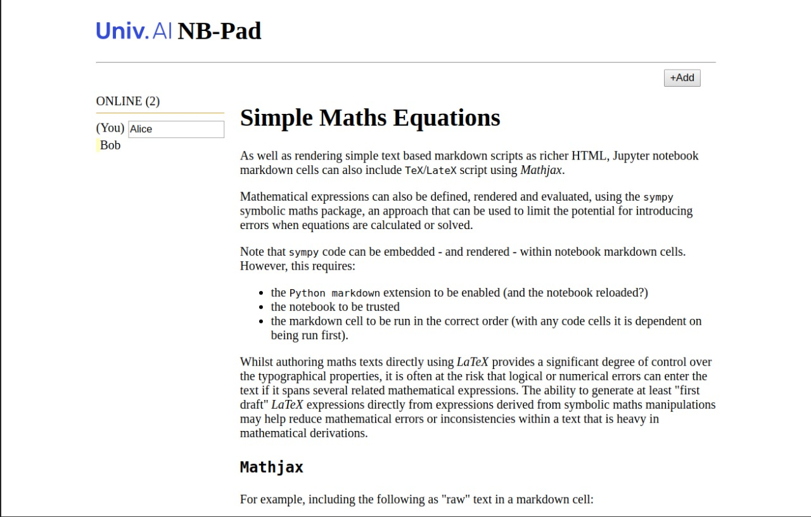
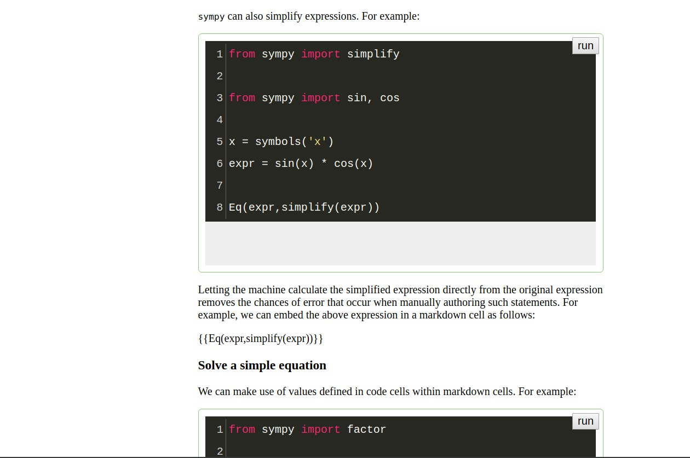

---
layout: page
title: NBPad
--- 

We've created a tool that will help you collaborate with your mentors or teachers.

Its a real time, collaborative code writing application, which allows you to work together on the code parts of a Jupyter Notebook, but run code separately. 

We are calling it NBPad, to invoke comparisons to Etherpad.

## Uploading

If you have a problem with your code and want a mentor to help you, you can upload a notebook or a zip file with notebook, data, and image files to our server.

.jpeg)

## A unique identifier 

The notebook will be served with a unique id. This unique id creates a unique URL that can be shared with your teacher. She can now edit cells along with you, and let you run the code separately from him or her. (Here Bob is the student and Alice is the teacher).

## Running is individual, editing is collaborative

While Alice and Bob can edit together, they dont run their code in the same python kernel. When each user hits the run buttons, the code runs in each user's own Python Kernel. Thus users cannot clobber each other's environments. Videoconferencing can be used to share the different outputs, is there are discrepancies.

The same unique id can be used to set up a Jitsi videoconf, so you can talk about your code. We provide a link for this. We are adding this functionality as well as the option for real time collaborative chat as in Etherpad.