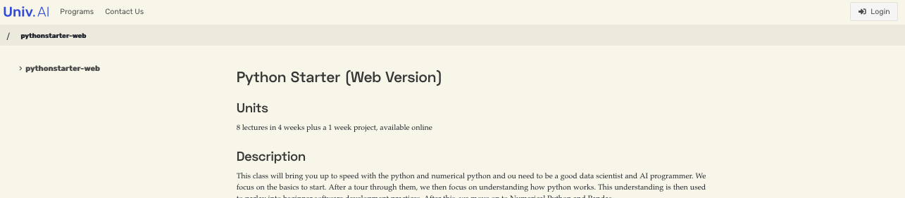
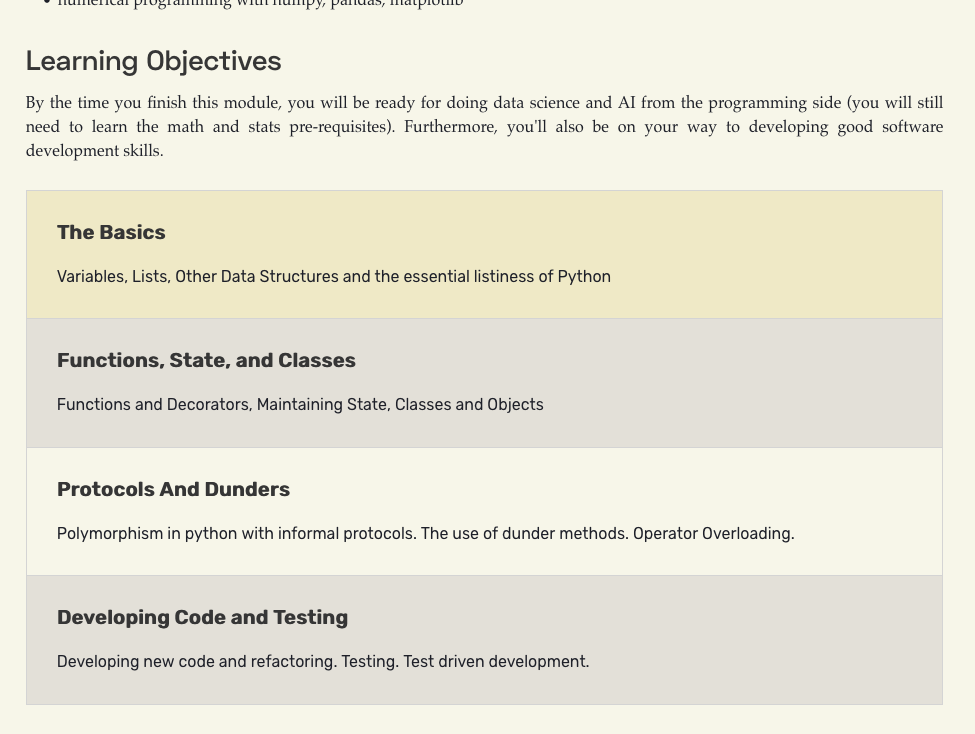
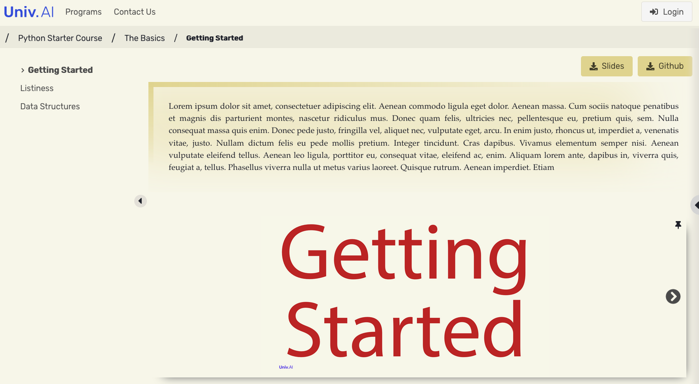
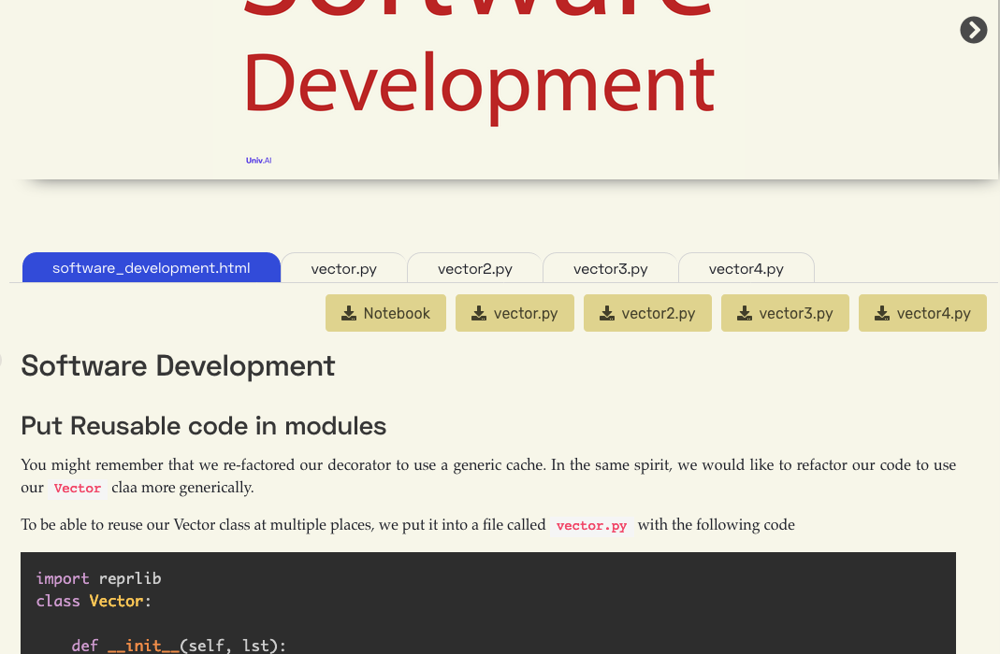
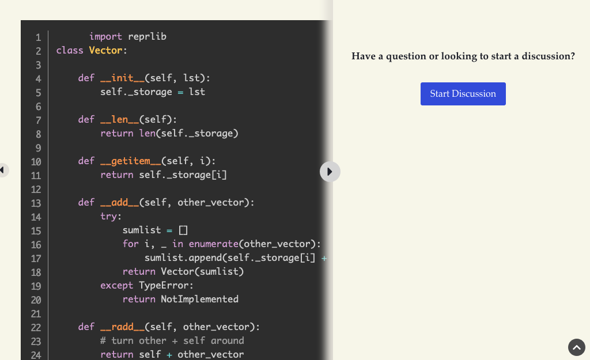
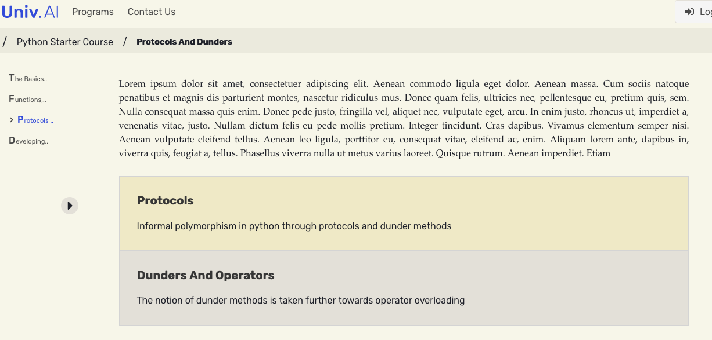

---
layout: page
title: The courses.univ.ai platform
--- 

Still in heavy development (let us know your ideas!), [course.univ.ai](https://course.univ.ai) is our innovative e-learning platform. When you log on to the platform, you can access your courses. When you go to a course, the introductory page shows you the description, ...

and a table of contents for the various chapters of the course.

If you click on a chapter, you might step into a learning section/ Here you have learning objectives, some slides, some code and notes, links to exercises, and summaries. You can download notebooks and pdf versions of the slides to doodle on.

## Complex workflows

Sometimes, a chapter may have many file assets. The screen below works through a re-factoring process, where monolithic code in a Jupyter notebook is split into library code in a file, and client code in a notebook, with tests added. Later we do some test-driven development.

You may want to initiate or participate in our discussions about a particular lesson. You can do this right from the user interface. We are soon adding the ability to discuss parts of notes and slides rather than the full lesson, so that individual idea can be micro-discussed.

The slide and notes area can be made wider, with the table of contents on the left still being "make-out-able" so that you can navigate easily.

## Pinning

pinning is one of the most innovative aspects of the platform. You can use the pin icon on slides or videos to pin them immovable on the web page. When you enter this mode, videos and slides get synchronized to notes, so that you can advance the slides, notes or video, and jump to the appropriate spot on the material that the video, for example, is talking about. Here is a short video on it.

<iframe width="560" height="315" src="https://www.youtube.com/embed/I4sDar7lXZs" frameborder="0" allow="accelerometer; autoplay; encrypted-media; gyroscope; picture-in-picture" allowfullscreen></iframe>