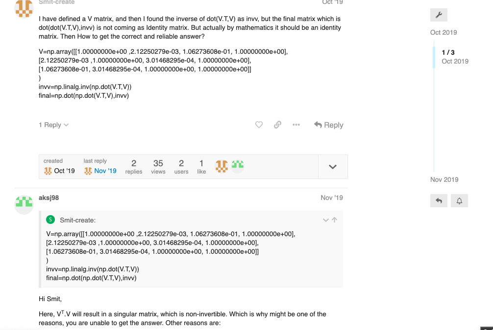
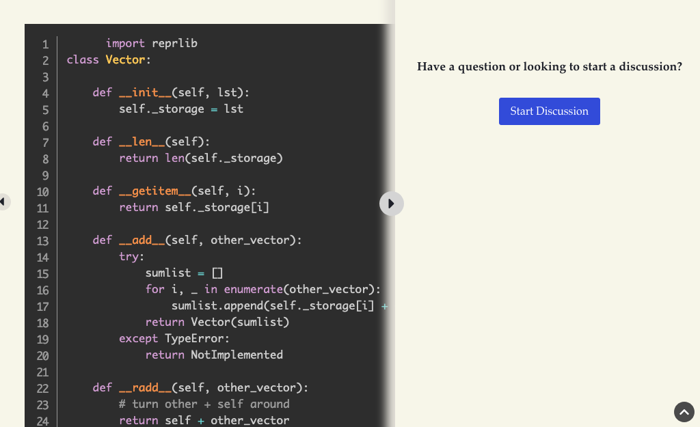
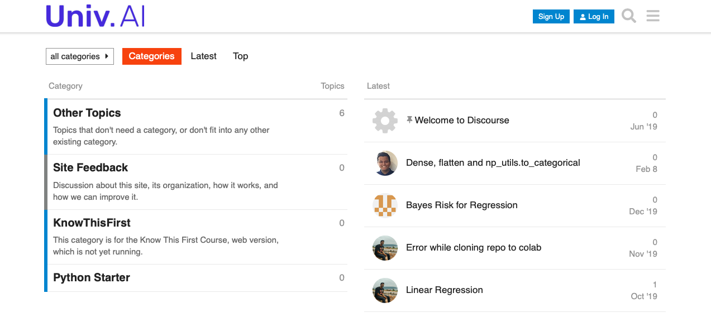
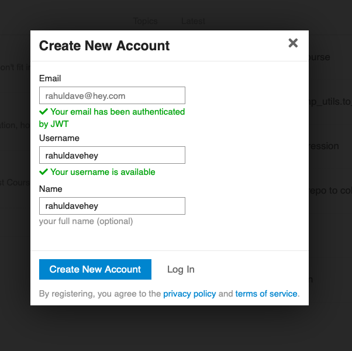
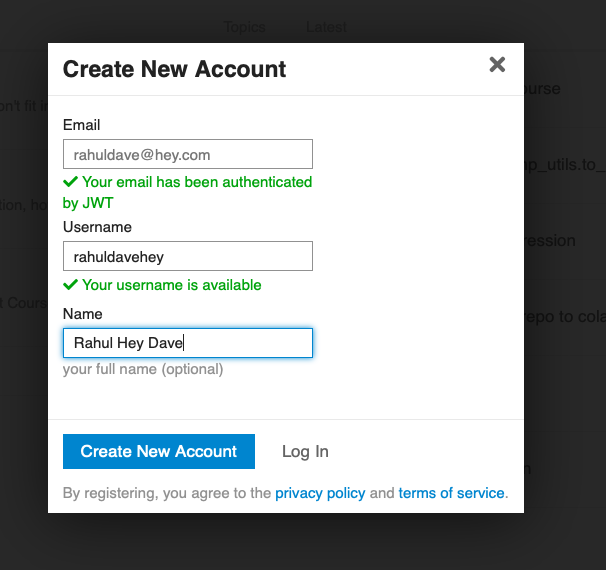
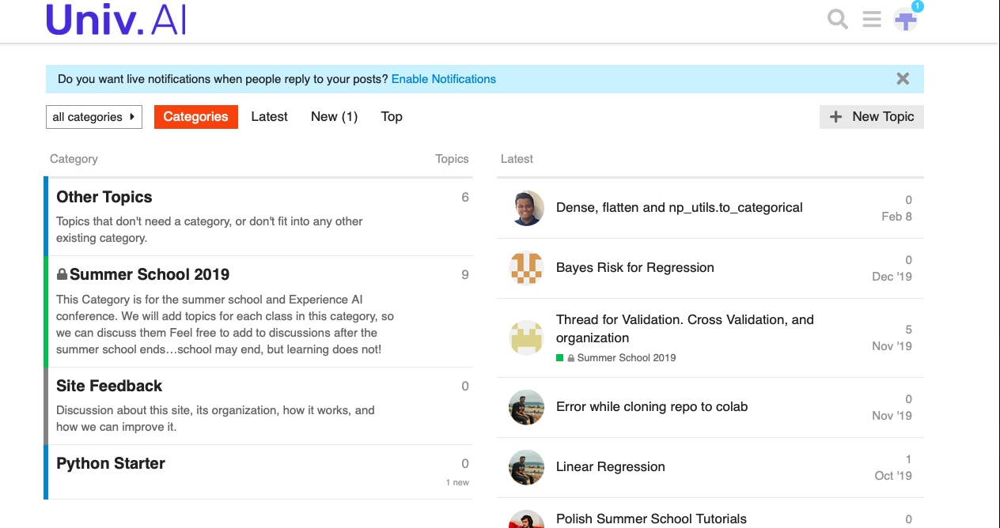
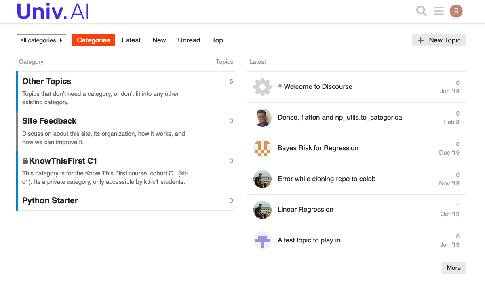

---
layout: page
title: Discourse
--- 

Our main tool for discussion is going to be a forum.

What?, you say, something as old school as a forum?

It has been found that forums foster community. A place where students can discuss with each other, ask each other questions, ask mentors questions.

But there is more. In todays era we are usually on some chat application. Whatsapp, Facebook Messenger, etc. There is always the temptation to ask questions via chat. Resist it. Chat is ephemeral: you will not have a record of the brilliant discussion around something that you had and you will forget.

For this reason most open source and science communities now do forums.

We'll be using [Discourse](https://discourse.univ.ai) as our online forum. It’s important that you pose questions in Discourse: this creates a permanent record for your question and allows for other students to help you. TFs and Professors will guide the discussion. 

**You participation grade depends on you taking part in discussions**.

But Wait, there's more! We have set our platform up so that discussions can be had directly from lessons in our discussions page! We'll have more details about this later. (but see below)

## Logging on to Discourse

There are two parts to this. First you will use your Univ.AI account to create a Discourse account. This process is seamless. You just click the login or signup button on the upper right corner of [discourse.univ.ai](https://discourse.univ.ai).

Once you click it, you will either see the dialog below, or  be redirected to login to the [courses.univ.ai](https://courses.univ.ai) web site, where you must login. If the latter happened, after you log in, you will be redirected to the dialog below. Here the username firls will be filled in with your Univ.AI username. Your name will also have this username.

You might want to change your name to something more human readable...

..ok maybe my new name is not that much more readable :-). Click the "Create New Account" Button. Boom, you are in, and will see a window like below.

Where's "Know This First". Its not there because we need to add you to the group for the course. 

For this you will need to fill up the "Information Form" we talked about on the index page where we ask for your github id, Univ.AI id, and discourse id. We'll use the discourse id to add you to the course group. Once that is done, you will see the KnowThisFirst C1 category, which is private to our class.

You are welcome to post anywhere on the forum you have access. However, we'll be using the "Know This First C1" category for our class.