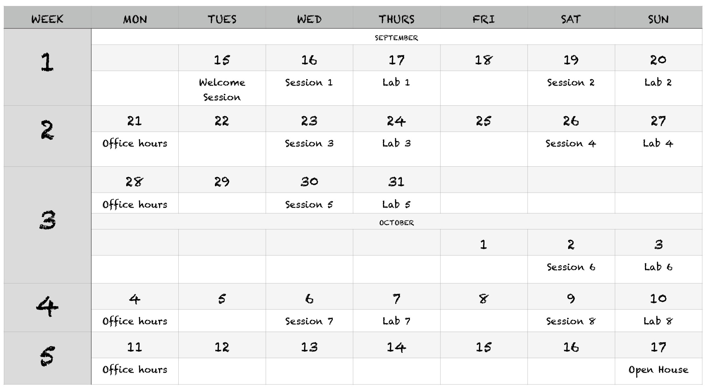
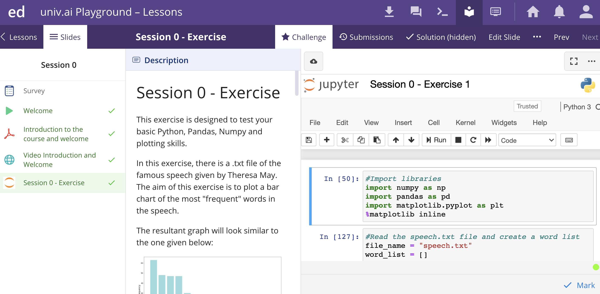
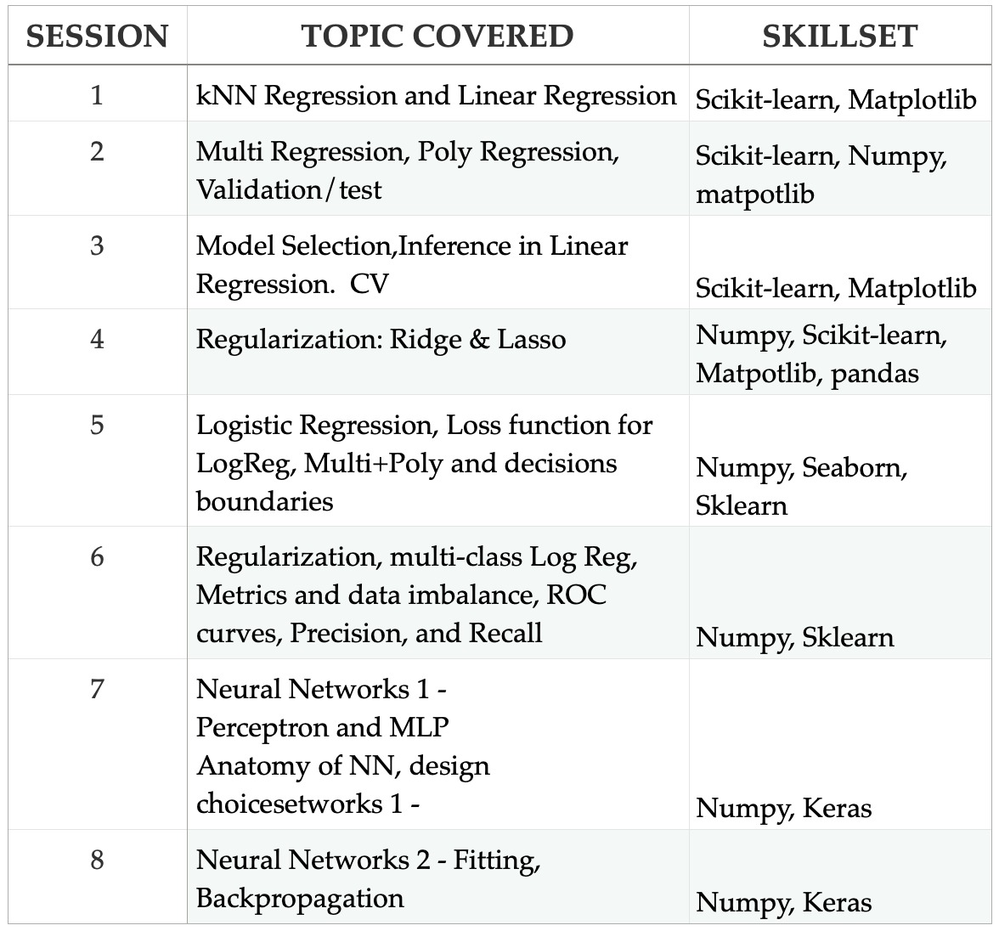

---
# Feel free to add content and custom Front Matter to this file.
# To modify the layout, see https://jekyllrb.com/docs/themes/#overriding-theme-defaults

layout: page
title: Foundations/Know This First
---

## Artificial Intelligence - C001 🤖

>*Statistics, Math, Computer Science. Physics.Long ago, the four disciplines lived together in harmony. Then, everything changed when the Computer Science attacked. Only data science, master of all four elements, could stop them, but when the world needed it most, it was not invented. A few years ago the world  discovered the new master, a data scientist called  Pavlos, whose mission was to train the next generation in the mystic arts of Data Science*

Welcome to the **First Edition** AI-C001.

This page introduces you to your team, the basic instructions and the schedule of the various elements of our class.


We assume you have a [Univ.AI](https://courses.univ.ai) account, created when you signed up at [courses.univ.ai](https://courses.univ.ai). If not, email [programs@univ.ai](mailto:programs@univ.ai).


### Education software we use

- Our lectures and labs are carried out via [Zoom](zoom.md) (install instructions).
- Quizzes & exercises will be conducted on the digital learning platform [Ed](https://edstem.org/).
- Ocassionally, we may conduct in-class contests on [kaggle](https://www.kaggle.com/). Please register on kaggle and familarize yourself with it, if you haven't already done so. 


## Team

### Dr. Pavlos Protopapas - Your Data Science Guru
<p align="center">
  
</p>


Scientific Director of the Institute for
Applied Computational Science (IACS).<br>Teaches CS109a, CS109b and the
Capstone course for the Data Science
masters program. <br>He is a leader in
astrostatistics and he is excited about
the new telescopes coming online in
the next few years. He loves cooking
and eating.
<br>You can [read more about him here](https://www.univ.ai/teams/pavlos-protopapas-2).

The teaching assistants for the duration of this course are

- Varshini Reddy, your head TA
<p>
  
</p>

- Hargun Oberoi

<p>
  


They will be assisted, especially on the forums, by

- ??
- ??

### The Class

- Lectures with Labs interwoven in, supported by your professor and TAs.
- Every lecture has exercises after some sections. You are expected to do these exercises in class. You are not expected to get them right: it is more important for us (and you) that you participate. This participation **counts** towards your grade. You will always be able to go back to these exercises.
- Homework: There will be a homework every week with a maximum of 2 questions. This homework should not take more than 7-8 hours.
- Participation is key and carries points
- Additional office hours are scheduled as well to help you with additional questions.
Your TAs and professors will be there to help with the material, homework, and any other questions you might have.


Our module policies around collaboration and grading are listed [here](policy.md). Our expectations of you are also laid out in that document.

### High level course schedule



*NOTE*: Below timings are in IST

**Lecture Sessions**: 
- Wednesday Series: ```8PM - 10PM ```
- Saturday Series: ```6:30 PM - 8:30 PM ```

**Lab Sessions**: 
- Thursday Series: ```7:30PM - 8:30PM``` 
- Sunday Series: ```3PM - 4PM```

**Office hours**: 

*TBD*

There will be a ```Welcome Session``` scheduled on ```15 September 2020``` at ``` 7PM IST ``` for all registered students. Please check your mail for more information. 

What about all the stuff you are going to learn? You can see a more detailed [schedule](schedule.md) with detailed topics. It is going to be a fun time!

### Course Pre-Requisites 

Your are expected to have a working knowledge of python, along with these three libraries:

- Numpy
- Pandas
- Matplotlib

All exercises in this course will be done in [jupyter notebooks](https://jupyter.org/)

> Note: No prior knowledge of machine learning libraries is necessary for this module


Before you begin the course, we have prepared for you a simple exercise to ensure your proficieny of the above libraries. 

This will help you assess your preparedness for the course, and will also help you familiarize yourself with the platform.



Please find a more detailed summary of the pre-requisites for this program [here]() 


### Course Syllabus

Here is a high level overview of what you will learn in this course.



You can find a more detailed syllabus [here]()


### Parting note

As you will learn in this course, data science is not just about writing efficient algorithms.

It requires proficiency in critical thinking, ideation & presentation, along with strong foundations in statistics, computer science & mathematics.

Keeping that in mind, you are adviced to give your full active attention to every session, homework & exercise.

We wish you best of luck for your data science journey.

