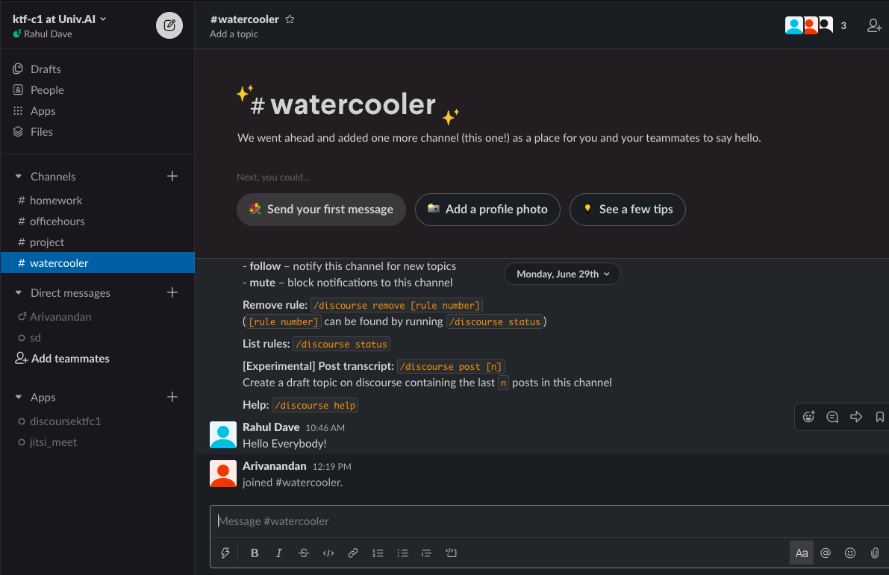
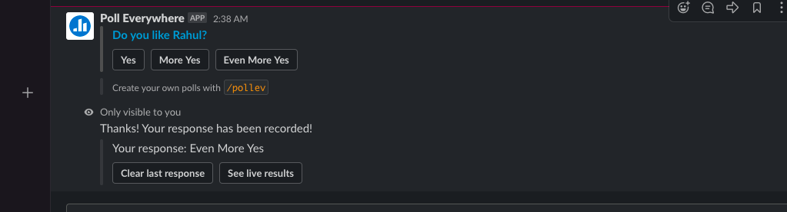
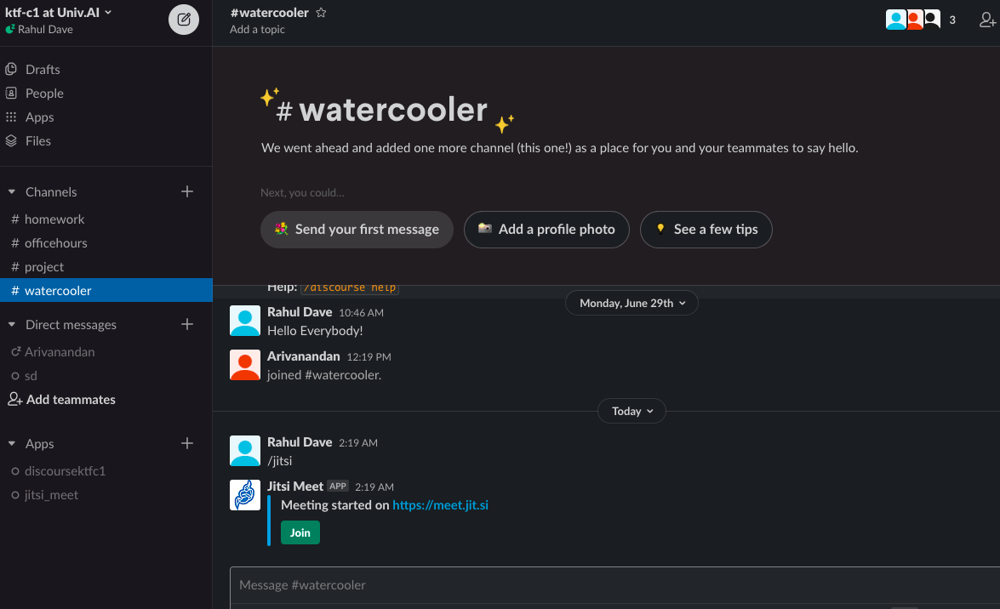

---
layout: page
title: Joining Slack
--- 

In one of the emails we sent you, you will have found an invite link for the chat application Slack. Please click on that link and sign up for slack.

## Why use chat

The forums at [discourse.univ.ai](https://discourse.univ.ai) are the right places to have extended and interesting discussions about various topics.

However matters of logistics and co-ordination often require immediate action. You might want to

- set up a meeting with some of your friends
- just get to know everyone
- do a quick video chat with another person or with members of your group (`/jitsi` on any channel is the ticket)
- collect questions while lecture is on to ask the professor
- do polls
- point people to questions answered or discussions had on discourse. Type `/discourse help` for details. You can even archive some parts of conversations to discourse.

We have multiple chat channels, and you can create your own for ad-hoc sub groups.

- `#watercooler` for just chatting. All suitable-for-work subjects acceptable here
- `#homework` for homework conversation
- `#project` for project conversation
- `#officehours` for office hour co-ordination and questions
- `#lecture` for within lecture logistics and question collection

Below you can see a Jitsi videoconference being set up in the `#watercooler ` channel...

[This](https://m.signalvnoise.com/is-group-chat-making-you-sweat/) is a good article that lays out the pros and cons.