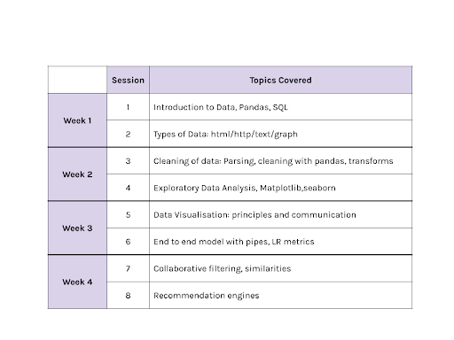
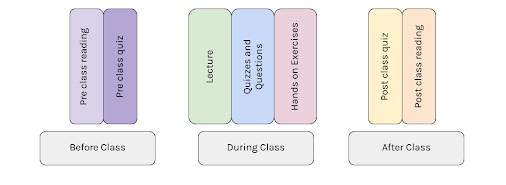
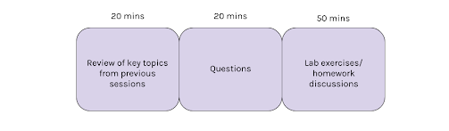
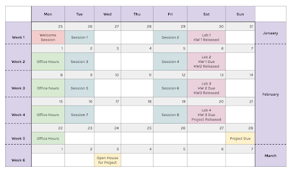

---
# Feel free to add content and custom Front Matter to this file.
# To modify the layout, see https://jekyllrb.com/docs/themes/#overriding-theme-defaults

layout: page
title: Machine Learning and Data Science - ML1
---

## ML1: Machine Learning and Data Science

Welcome to the **First Edition** (Cohort **C1**) of ML-1

The objective of this module is to provide a fundamental understanding of data analysis.  The course proceeds in 3 parts, following the Data Science Process:

**Obtain and clean the data**: we will teach you how to obtain, clean, and process data from different sources such as scraped web pages, spreadsheets, APIs, and documents. 

**Exploratory Data Analysis**: we develop your skills in pre-modeling and post-modeling exploratory data analysis and visualization. This part is all about understanding your data.

**Modeling**: We choose some very specific models to cover, from the perspective of teaching techniques which are generalizable to any models. Thus we will cover classification and recommendation engines. We'll also cover similarity and PCA, as a way of understanding structure in your data and the models you ran on them.

After you finish this module, you will be ready to run the entire data science process, all on your own, from fetching (from the internet or databases) and cleaning the data, setting up pipelines, to exploratory data analysis, visualization, and modeling.

This page introduces you to the team, the basic instructions, the schedule, and various elements of our class.

## Interested in Joining?

If you would like to apply to this course, please go [here](https://univ.ai/programs).

We also provide this course as part of our Masters and Accelerated program, check this [link](https://univ.ai/programs) out to get more information and apply.

## The Team

**Dr. Rahul Dave**

Dr. Rahul Dave, former Data Science faculty at Harvard University, will be your instructor for Data Science 1. You can read more about him here. In addition to the classes, you can schedule problem-solving classes with the faculty and mentors throughout the rest of the week.

The teaching assistants for the duration of this course are:

**Anusha Sheth**

- Anusha is working as a Research and Teaching fellow with Univ.ai, she has previously worked with Robert Bosch as a software engineer in the automotive domain.
- She is a big believer in sustainability and has been working on applications of AI in sustainable energy for the last 3 years.

**Arya Mohan**

- Arya is currently a data analyst at Schneider Electric and a Teaching Assistant at Univ.AI.
- She is passionate about image processing and is currently researching the application of computer vision in the detection of deep fake videos.

## The Coursework

We have very carefully designed the coursework to give you, the student, a wholesome learning experience.
Each week shall include:

- 2 Sessions
- 1 Lab
- Office hours

### Session: What to expect

Before the session begins, students are expected to complete a pre-class reading assignment and attempt a quiz based on the same.

A session will have the following pedagogy layout which will be repeated a few times:

- Approx. 10-15 minutes of live online instruction followed by a quiz
- Some sessions will have hands-on coding exercises or group activities
- Sessions will help students develop the intuition for the core concepts, provide the necessary mathematical background, and provide guidance on technical details.
- Sessions will be accompanied by relevant examples to clarify key concepts and techniques.

After the session, students are expected to complete a short post-class quiz based on the principal concepts covered in class and optional post-class reading will be provided.

### Lab: What to expect

A lab is a TA driven 1.5 hour session that is divided into 3 major parts. 

- Each lab begins by solving parts of a complete problem. This problem is designed to help you with your homework and further elucidate concepts you learned in lecture.
- After discussing exercises, we will have a semi-formal Q/A session. The first part of this session is limited to homework questions, but the second part is more free-for-all, where you can ask any doubts that lingered over from lecture.

## The Class

**Welcome Session** - Preparing for this class

There will be a Welcome Session scheduled on 25 January 2021 at 7:00 PM IST for all registered students. Please check your mail for more information.

NOTE: Below timings are in IST

**Lecture Sessions**: 
- Tuesday Series: 9:00 PM - 11:00 PM 
- Friday Series: 9:00 PM - 11:00 PM

**Lab Sessions**: - Saturday Series: 7:30 PM - 8:30 PM

**Office hours**: - Mondays: 9:00 PM - 10:00 PM

## Course Pre-Requisites

You are expected to have a working knowledge of python, along with these three libraries:

- Numpy
- Pandas
- Matplotlib
- 
All exercises in this course will be done in Jupyter notebooks.

Before you begin the course, we have prepared for you a simple exercise to ensure your proficiency in the above libraries.

MORE SOON.

You must know the basic concepts of Machine learning, as embodied in the course ml-prep. If not take it: its one weekend long and will bring you up to speed.

## Logistics: What do you need to begin?

### Do this first!

We assume you have a [Univ.AI account](https://courses.univ.ai), created when you signed up at [courses.univ.ai](courses.univ.ai). If not, email [programs@univ.ai](mailto:programs@univ.ai).

- You **MUST** connect your [courses.univ.ai](https://courses.univ.ai) account to [Github](https://github.com). [Here](github.md) (install instructions) is how to do it!
- You **MUST** log on to [discourse.univ.ai](https://discourse.univ.ai) forum software. [Here](discourse.md) (install instructions) is how to do it.
- Before the first class, you will want to [install Anaconda Python](anacondapython.md) and play with Python a little bit. You will learn a bit about Jupyter notebooks, and a bit about Python coding. We'll talk about Anaconda in class.

### Class Policies

COMING SOON

### Education software we use

- Our lectures and labs are carried out via [Zoom](zoom.md) (install instructions). You **MUST** install Zoom for class. Ad-hoc video communication is carried out on [Jitsi](https://meet.jit.si).
- We have an innovative [platform](https://courses.univ.ai) for our courses. Here is some [usage information](platform.md) for it. We will talk about the platform in class.
- We have a fun collaborative Jupyter notebook software, [NBPad](nbpad.md) where teacher and student can code together but run the code individually so as not to clobber each other. We will talk about this in class as well.
- Quizzes & exercises will be conducted on the digital learning platform Ed. (Details coming soon)

## Diversity & Inclusion

We actively seek and welcome people of diverse identities, from across the spectrum of disciplines and methods since Artificial Intelligence (AI) increasingly mediates our social, cultural, economic, and political interactions [1].

We believe in creating and maintaining an inclusive learning environment where all members feel safe, respected, and capable of producing their best work.

We commit to an experience for all participants that is free from – Harassment, bullying, and discrimination which includes but is not limited to:

- Offensive comments related to age, race, religion, creed, color, gender (including transgender/gender identity/gender expression), sexual orientation, medical condition, physical or intellectual disability, pregnancy, or medical conditions, national origin or ancestry.
- Intimidation, personal attacks, harassment, unnecessary disruption of talks during any of the learning activities.

Reference:

[1] K. Stathoulopoulos and J. C. Mateos-Garcia, “Gender Diversity in AI Research,” SSRN Electronic Journal, 2019 [Online]. Available: http://dx.doi.org/10.2139/ssrn.3428240.

