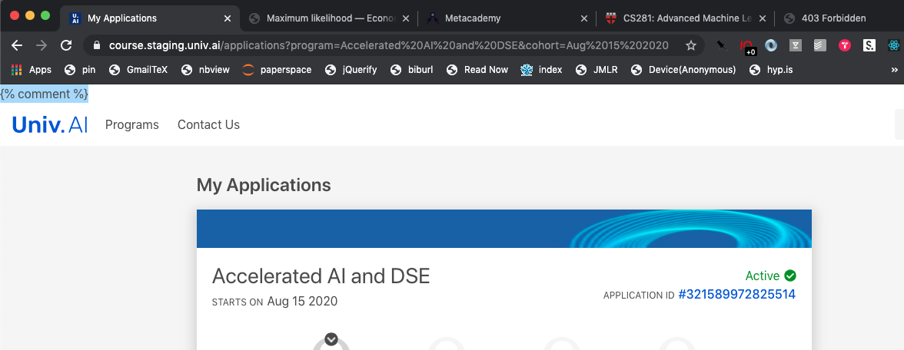
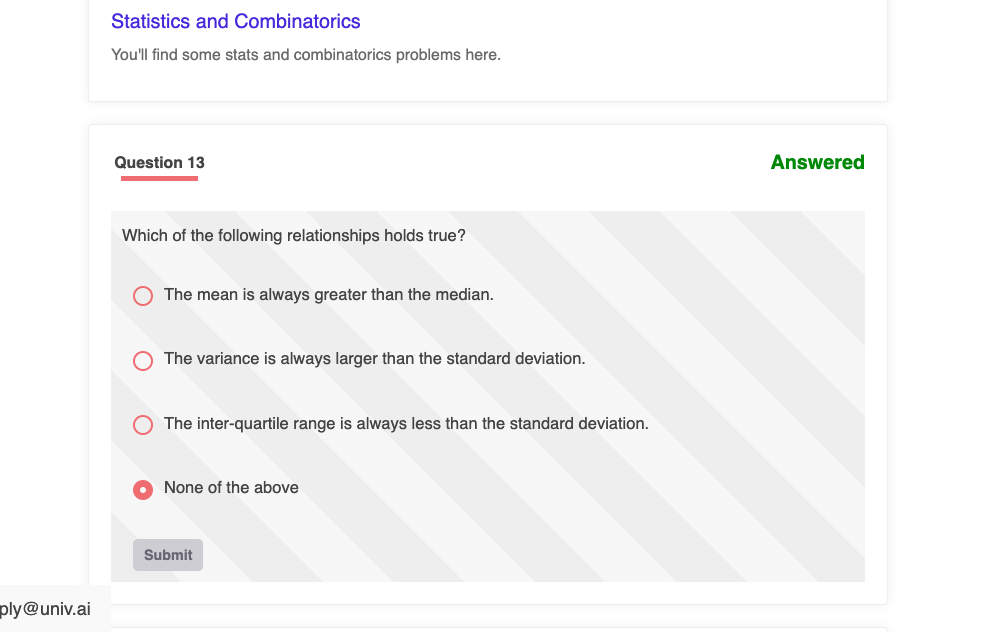

You have possibly already seen our test and exercise system, if you gave the foundations scholarship test, or the foundations pre-requisites tests.

## Capabilities

Its a fairly new system, but allows us to provide you with Multiple Choice Questions, and the ability to run code on a cloud backend. Currently we use the Open Source [MyBinder](https://us.mybinder.org) service, but are implementing our own cloud (which [NBPad](nbpad.md) will use as well).

In the future, we will be implementing Anki Decks on this platform as well. We also use [EdStem](https://us.edstem.org) for some of our classes, which is a system used at Harvard and other places.

## Exercises

Exercises are a huge part of our courses. We think that they serve two purposes: they consolidate what you just learnt in lecture, and when asked at later times, jog your brain into remembering what you learned a little while back. We hope you'll enjoy them.

You will be asked to solve exercises every 2-3 lecture segments. Its more important you participate than get them right, your grade on them is weighted towards participation rather than correctness. Without participation, [conversation](slack.md), [discussion](discourse.md), there is no learning.

From time to time, we'll create ad-hoc tests as well, without grading, so that you can self-check your learning progress.