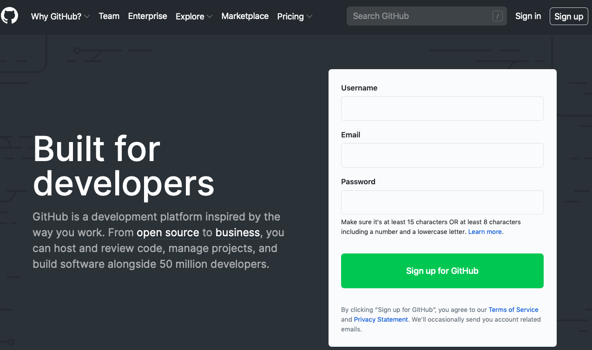
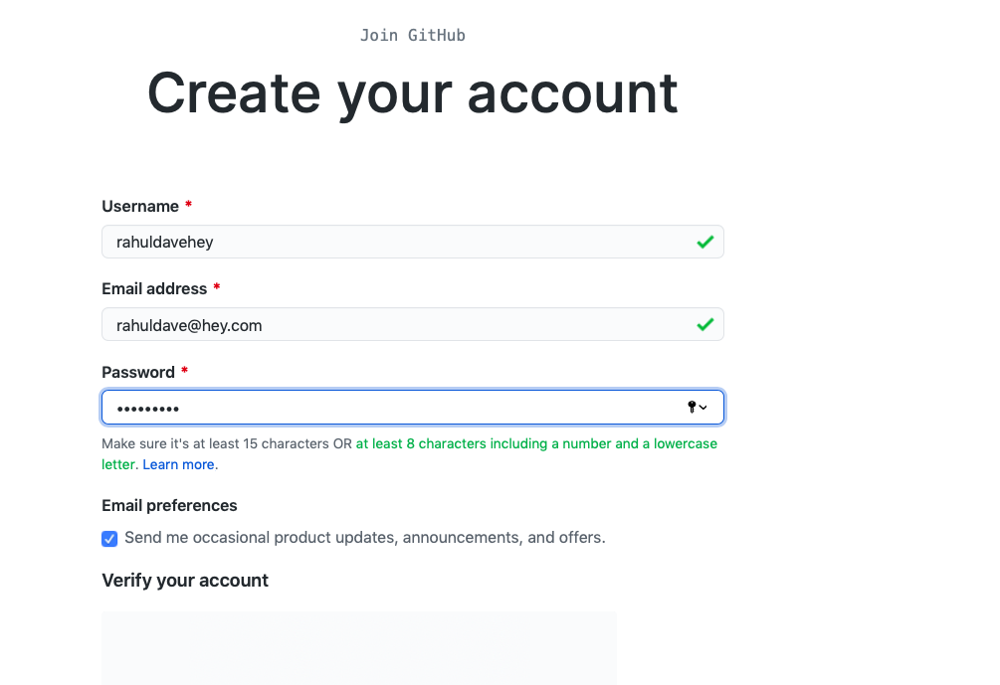
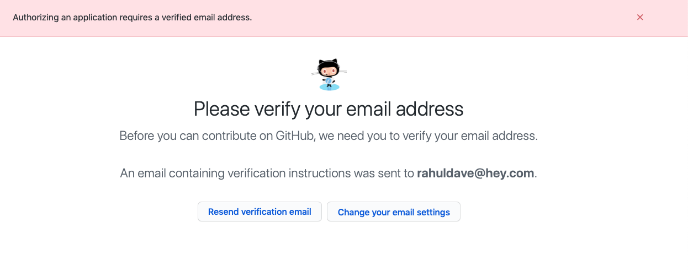
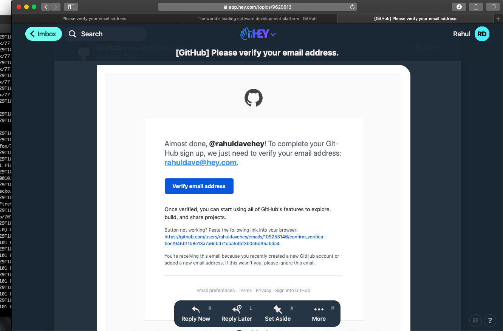
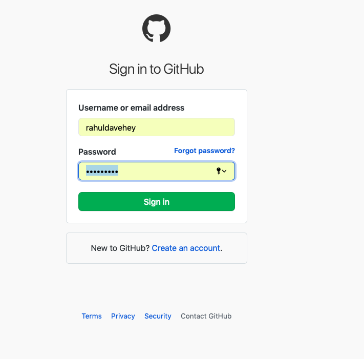
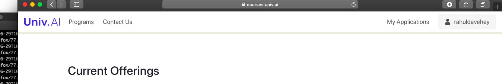
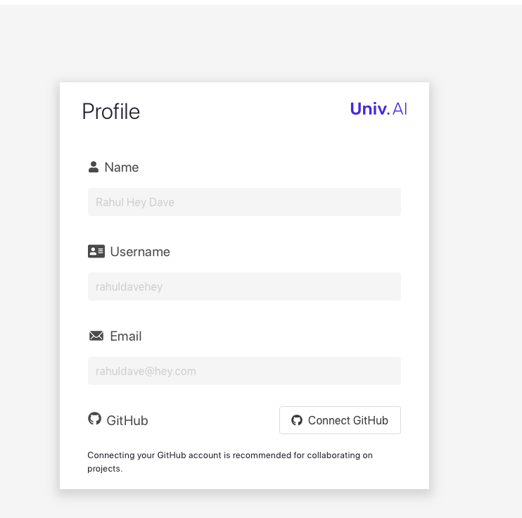
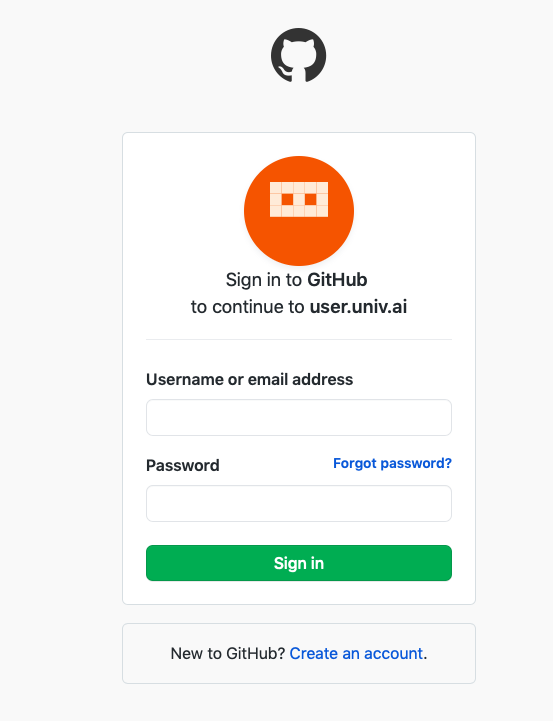
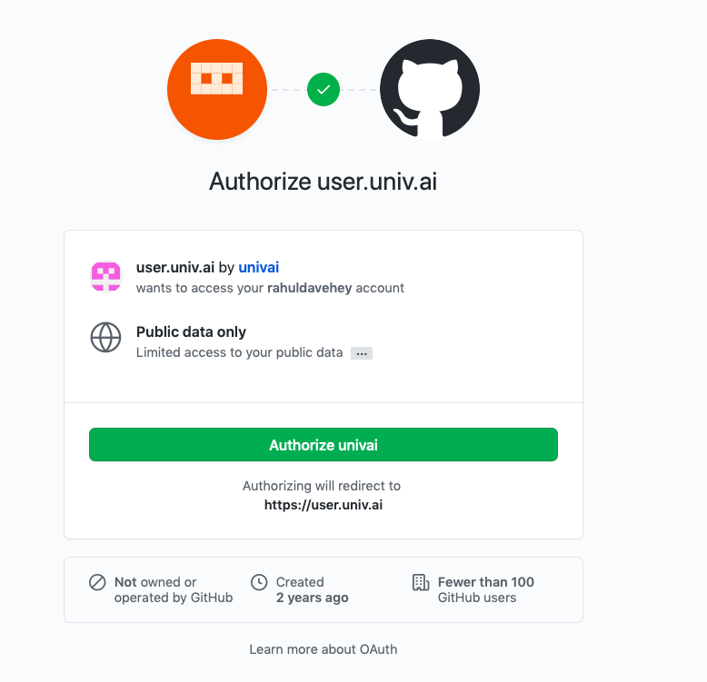
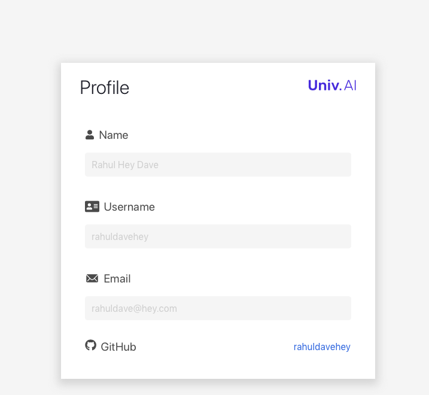

---
layout: page
title: Becoming a github user
--- 

Some of you have logged into our system [course.univ.ai](https://course.univ.ai) using email, and some of you have logged in using github.

Github is at the heart of a lot of our courseware systems, and at the heart of many workflows that Data Scientists and AI professionals engage in. You are going to have to become git and github experts.

Our code repositories are made available via github, and we will be teaching you how to use it. But you must have a github account and connect it to our system first.

If you logged into our system using github you dont need to do any of the stuff that follows. Otherwise, read on!

## Creating a Github Account

Head over to [Github](https://github.com). Click the "Sign Up" button on the upper right and create your account:

It will now ask you to verify your email address. Please do so. It is important you supply github an email address as this is needed to connect github and our platform.

Verify your email address by clicking on the link inside your email. Depending upon how you do email..mobile etc..you will be logged on to github.

If you need to (incase your email client is different from your browser), log on again into github:

## Connect the accounts

We will be connecting your github account to your Univ.AI account.

Log on into your [Univ.AI](https://courses.univ.ai) account the way you usually do (by clicking on the login button in the upper right hand corner), using email and OTP. When you do this the word Login changes to your username, here `rahuldavehey`. Now I want to link this Univ.AI `rahuldavehey` account to by brand new github account, for which I have conveniently used the same username. To do this, click on the upper right hand side button with your username:

This will bring up a dialog in which your name, username and email are reported but not editable, and a button that asks you to "Connect Github". Click it.

On clicking the button you might be asked to sign in to github with a dialog like this. Sign in. (Depending on how your cookies are set, you might not be asked to do this)

Once you sign in, you will be asked to authorize our application. Click "Authorize univai". You will notice that we ask for very limited information from your github account. We **value and respect your privacy**.

Once you have authorized our application, you have connected your univai account to your github account! Yay! This is reflected in the profile dialog:

At this point you will need to fill up the "Information Form" we talked about on the index page where we ask for your github id, Univ.AI id, and discourse id. We'll use the github id to add you to the course organization on github.